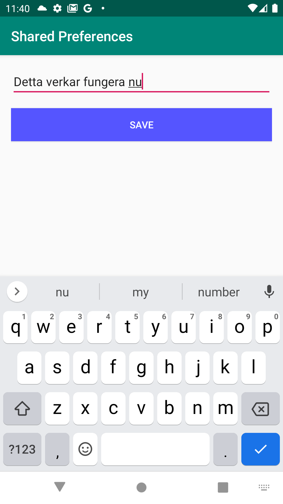
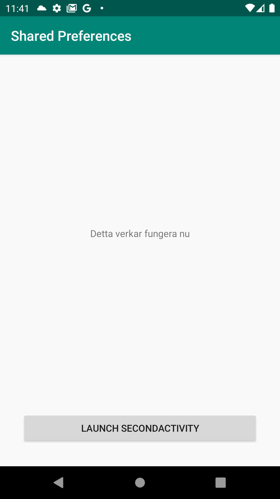

# Rapport

Först skapdes den andra aktiviteten. Denna populerades sedan med ett textfält (EditText) och en knapp för att spara det som skrivits in. I xml filen för andra aktiviteten sattes attributen _onClick_ på knappen till "saveToSharedPreferences". En funktion vid detta namn skapdes därefter i classen SecondActivity, se kodblocket nedan:

```java
public void saveToSharedPreferences(View view) {
    if (editText.getText().toString().equals("")) {
        Log.d("Preferences", "Empty string");
        return;
    }

    this.preferences.edit().putString("text", editText.getText().toString()).apply();

    finish();
}
```

Funktionen skriver värdet på textfältet till objektet preferences och går tillbaka till MainActivity endast om textfältet har ett värde. Om textfältet inte skulle ha ett värde, det vill säga en tom string, kommer ingenting ske. Objekt _preferences_ är en privat instans av SharedPreferences som initierdes i _onCreate()_ funktionen, se kodblock nedan:

```java
this.preferences = getSharedPreferences("com.example.project.data", Context.MODE_PRIVATE);
this.editText = findViewById(R.id.editText);
```

När texten skrivits till SharedPreferences, stängs SecondActivity med funktionen `finsih()`, se första kodblocket. När MainActivity får focus igen kommer funktionen _onResume()_ kallas. Denna funktion överskrevs därför för att se till att värdet på ett TextView kan uppdateras. Ett TextView lades därför till i activity_main.xml och referades i MainActivity. Referensen sparades i variabeln `private TextView resultText;`. För att sedan uppdatera implementerades följande kod i classen MainActivity:

```java
@Override
protected void onResume() {
    super.onResume();

    String text = preferences.getString("text", "Shared Preferences");

    resultText.setText(text);
}
```

För att köra den andra aktiviteten behövdes en knapp som kunde starta aktiviteten. En knapp som vid klickning startade SecondActivity implementerades därför också i MainActivity.

### Bilder från app

<h4>Initial app</h4>


<h4>Ändrar text</h4>


<h4>Spara trycktes och SecondActivity stängdes</h4>

